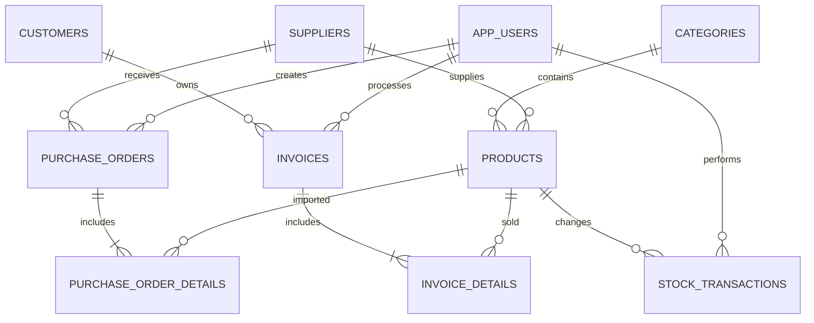

# Grocery Store Database Structure

Database: `grocery_store`
Database engine: PostgreSQL 17

## Entity relationship diagram



## Tables

### `stores`

Represents one independent store/tenant. Users and all business records belong to a store through `store_id`.

| Column | Type | Description |
|---|---|---|
| `id` | BIGSERIAL | Primary key |
| `code` | VARCHAR(30) | Unique code used during login |
| `name` | VARCHAR(150) | Store display name |
| `phone` | VARCHAR(20) | Optional contact phone |
| `address` | VARCHAR(500) | Optional address |
| `active` | BOOLEAN | Store status |

### `app_users`

Stores application accounts.

| Column | Type | Description |
|---|---|---|
| `id` | BIGSERIAL | Primary key |
| `username` | VARCHAR(50) | Unique login name |
| `password_hash` | VARCHAR(255) | BCrypt password hash, never plain text |
| `full_name` | VARCHAR(120) | Employee name |
| `role` | VARCHAR(20) | `SUPER_ADMIN`, `ADMIN` or `CASHIER` |
| `active` | BOOLEAN | Account status |
| `auth_version` | INTEGER | Invalidates existing sessions after security-sensitive changes |
| `store_id` | BIGINT | Tenant owner, FK to `stores` |

The reserved store code `SYSTEM` owns Super Admin accounts. It contains no
tenant business data; Super Admin screens query store metadata only.

### `categories`

Product categories such as drinks, snacks and seasoning.

| Column | Type | Description |
|---|---|---|
| `id` | BIGSERIAL | Primary key |
| `code` | VARCHAR(20) | Unique category code, e.g. `DM001` |
| `name` | VARCHAR(100) | Unique category name |
| `description` | VARCHAR(500) | Optional description |
| `active` | BOOLEAN | Soft-delete status |

### `suppliers`

Stores supplier contact information.

| Column | Type | Description |
|---|---|---|
| `id` | BIGSERIAL | Primary key |
| `code` | VARCHAR(20) | Unique supplier code, e.g. `NCC001` |
| `name` | VARCHAR(150) | Supplier name |
| `phone`, `email` | VARCHAR | Contact information |
| `address` | VARCHAR(500) | Supplier address |
| `active` | BOOLEAN | Supplier status |

### `purchase_orders`

Stores multi-product stock receipts. A `DRAFT` order does not change inventory;
`COMPLETED` adds stock and `CANCELLED` reverses a completed receipt when enough
stock remains.

| Column | Type | Description |
|---|---|---|
| `id`, `store_id` | BIGINT | Tenant-scoped identifier |
| `code` | VARCHAR(20) | Receipt code, e.g. `PN001` |
| `supplier_id` | BIGINT | Supplier |
| `created_by` | BIGINT | User who created the receipt |
| `status` | VARCHAR(20) | `DRAFT`, `COMPLETED`, `CANCELLED` |
| `total_amount` | NUMERIC | Sum of receipt details |
| `completed_at`, `cancelled_at` | TIMESTAMPTZ | Workflow timestamps |
| `cancelled_by` | BIGINT | User who cancelled the receipt |

### `discount_codes`

Stores tenant-scoped promotion codes used by POS checkout.

| Column | Type | Description |
|---|---|---|
| `code` | VARCHAR(40) | Unique code inside one store |
| `discount_type` | VARCHAR(20) | `PERCENT` or `AMOUNT` |
| `discount_value` | NUMERIC | Percentage or fixed amount |
| `minimum_order` | NUMERIC | Required order subtotal |
| `maximum_discount` | NUMERIC | Optional cap for percentage discounts |
| `starts_at`, `ends_at` | TIMESTAMPTZ | Optional validity window |
| `usage_limit`, `used_count` | INTEGER | Optional global usage limit |
| `active` | BOOLEAN | Soft-lock status |

### `products`

Stores product master data and current stock.

| Column | Type | Description |
|---|---|---|
| `id` | BIGSERIAL | Primary key |
| `code` | VARCHAR(20) | Unique product code, e.g. `SP001` |
| `barcode` | VARCHAR(50) | Optional unique barcode |
| `name` | VARCHAR(180) | Product name |
| `category_id` | BIGINT | FK to `categories` |
| `supplier_id` | BIGINT | Optional FK to `suppliers` |
| `cost_price` | NUMERIC(14,2) | Purchase price |
| `selling_price` | NUMERIC(14,2) | Selling price |
| `stock_quantity` | INTEGER | Current stock, cannot be negative |
| `minimum_stock` | INTEGER | Low-stock warning threshold |
| `unit` | VARCHAR(30) | Item unit: bottle, can, pack, etc. |
| `active` | BOOLEAN | Product status |

### `customers`

Stores optional customer information used during checkout.

| Column | Type | Description |
|---|---|---|
| `id` | BIGSERIAL | Primary key |
| `code` | VARCHAR(20) | Unique customer code, e.g. `KH001` |
| `full_name` | VARCHAR(120) | Customer name |
| `phone` | VARCHAR(20) | Unique phone number |
| `email` | VARCHAR(150) | Optional email |
| `gender` | VARCHAR(20) | `MALE`, `FEMALE` or `OTHER` |
| `address` | VARCHAR(500) | Optional address |
| `customer_type` | VARCHAR(20) | `REGULAR` or `LOYAL` |
| `active` | BOOLEAN | Customer status |

### `purchase_orders`

Header of an inventory receipt.

| Column | Type | Description |
|---|---|---|
| `id` | BIGSERIAL | Primary key |
| `code` | VARCHAR(20) | Unique receipt code, e.g. `PN001` |
| `supplier_id` | BIGINT | FK to `suppliers` |
| `created_by` | BIGINT | FK to `app_users` |
| `status` | VARCHAR(20) | `DRAFT`, `COMPLETED` or `CANCELLED` |
| `total_amount` | NUMERIC(14,2) | Receipt total |
| `note` | VARCHAR(500) | Optional note |

### `purchase_order_details`

Products included in an inventory receipt.

| Column | Type | Description |
|---|---|---|
| `purchase_order_id` | BIGINT | FK to `purchase_orders` |
| `product_id` | BIGINT | FK to `products` |
| `quantity` | INTEGER | Imported quantity |
| `unit_cost` | NUMERIC(14,2) | Cost at import time |
| `line_total` | NUMERIC(14,2) | Generated: `quantity * unit_cost` |

### `invoices`

Checkout transaction header.

| Column | Type | Description |
|---|---|---|
| `id` | BIGSERIAL | Primary key |
| `code` | VARCHAR(20) | Unique invoice code, e.g. `HD001` |
| `customer_id` | BIGINT | Nullable FK; `NULL` means walk-in customer |
| `cashier_id` | BIGINT | FK to `app_users` |
| `payment_method` | VARCHAR(20) | `CASH` or `QR` |
| `status` | VARCHAR(20) | `PENDING`, `PAID` or `CANCELLED` |
| `subtotal` | NUMERIC(14,2) | Amount before discount |
| `discount_amount` | NUMERIC(14,2) | Discount amount |
| `total_amount` | NUMERIC(14,2) | Final amount |
| `cash_received` | NUMERIC(14,2) | Cash received; nullable for QR |
| `change_amount` | NUMERIC(14,2) | Change returned to customer |

### `invoice_details`

Products sold in each invoice.

| Column | Type | Description |
|---|---|---|
| `invoice_id` | BIGINT | FK to `invoices` |
| `product_id` | BIGINT | Nullable FK to `products` |
| `product_code` | VARCHAR(20) | Product-code snapshot |
| `product_name` | VARCHAR(180) | Product-name snapshot |
| `unit_price` | NUMERIC(14,2) | Price at checkout time |
| `quantity` | INTEGER | Sold quantity |
| `line_total` | NUMERIC(14,2) | Generated: `quantity * unit_price` |

Snapshots preserve invoice history when a product is renamed or deleted.

### `stock_transactions`

Audit log for every stock change.

| Column | Type | Description |
|---|---|---|
| `product_id` | BIGINT | FK to `products` |
| `transaction_type` | VARCHAR(30) | `IMPORT`, `SALE`, `ADJUSTMENT`, `RETURN` or `CANCEL_SALE` |
| `quantity_change` | INTEGER | Positive for stock-in, negative for stock-out |
| `stock_before` | INTEGER | Stock before transaction |
| `stock_after` | INTEGER | Stock after transaction |
| `reference_type` | VARCHAR(30) | Source type, e.g. `INVOICE` or `PURCHASE_ORDER` |
| `reference_id` | BIGINT | Source record ID |
| `reason` | VARCHAR(500) | Adjustment reason |
| `created_by` | BIGINT | FK to `app_users` |

Constraint: `stock_after = stock_before + quantity_change`.

## Low-stock view

`low_stock_products` returns active products where:

```text
stock_quantity <= minimum_stock
```

Statuses:

- `OUT_OF_STOCK`: quantity equals zero.
- `LOW_STOCK`: quantity is at or below the minimum.
- `IN_STOCK`: quantity is above the minimum.

## Transaction rules

Checkout must run in one database transaction:

1. Lock product rows.
2. Validate available stock.
3. Insert `invoices` and `invoice_details`.
4. Reduce `products.stock_quantity`.
5. Insert negative `stock_transactions` rows.
6. Commit; roll back everything if any step fails.

Completing a purchase order follows the same pattern, but increases stock and creates positive stock transactions.

## Source files

- Schema migration: `database/migrations/V1__create_schema.sql`
- Demo data: `database/migrations/V2__seed_demo_data.sql`
- Business-code sequences: `database/migrations/V3__business_code_sequences.sql`
